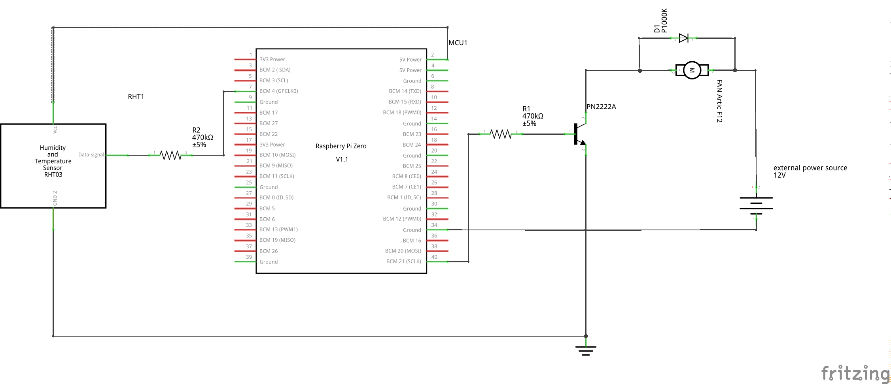

# VMC PROJECT

The goal of this program is to pilot a FAN in order to extract air in home.
There is two application: 
 1. extracting air in the bathroom if the humidity is above 65% 
 2. extracting air in the kitchen on a regular basis based on timestamp
 
 
 The fan is controlled with a raspberryPi zero (you will find) the image of the raspbian is included in the sources
 
 ## Material and electronics
 
 * Humidity an temperature sensor DHT11: https://www.amazon.fr/gp/product/B01LYBDXN5/ref=oh_aui_detailpage_o03_s00?ie=UTF8&psc=1
 * FAN: an PC FAN of 12cm wide will be ok, I use the following ARCTIC F12:  https://www.amazon.fr/gp/product/B002KTVFTE/ref=oh_aui_detailpage_o03_s00?ie=UTF8&psc=1
 * 12 volt power supply for the FAN it convert 220 v into 12 ,generally used for led light :https://www.amazon.fr/gp/product/B014SM4NP8/ref=oh_aui_detailpage_o01_s00?ie=UTF8&psc=1
 * raspberry pi zero
 * PN2222 BJTs as Transistor Switches (you can use a MOSFET also) I used the one included in the following kit: https://www.amazon.fr/gp/product/B01JD43262/ref=oh_aui_detailpage_o03_s00?ie=UTF8&psc=1
 * two resistors (see electrical drawing included as picture for specifications) 
 * one diode to prevent to get electricity back from the motor.
 
 ## Electrical drawing VMC with humidity SENSOR
 
 
 ## Electrical drawing VMC timestamp
 
